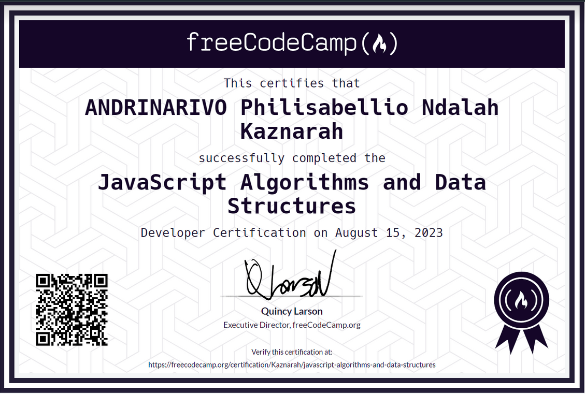

# Hello! it's `AmigosKazz` 🙋‍♂️

This repository contains my solutions to the exam tasks for the course "Data Structures & Algorithms in JavaScript" at FreeCodeCamp.

## Solutions
This repository includes five solutions:

1. `CeasarChipher`: A module for encryption and decryption using the Caesar Cipher algorithm.
2. `Palindrome`: A module for checking if a given string is a palindrome.
3. `RomanNumeralConverter`: A module for converting a number to its equivalent Roman numeral.
4. `TelephoneNumberValidator`: A module for validating if a given string is a valid US phone number.
5. `CashRegister`: A module for calculating the change in a cash register.

## Certification
I have earned a certificate for this course. You can view it here:

[

You can see the certificate : `https://www.freecodecamp.org/certification/yourusername/javascript-algorithms-and-data-structures`

Thank you for visiting this repository. Have a great day! 😁